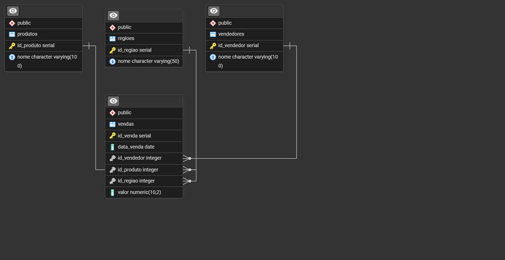

# Dashboard de Vendas 

Aplicação interativa desenvolvida em **Python (Streamlit)** para análise de dados de vendas em múltiplas dimensões — produto, vendedor, região e período.  
O sistema oferece visualização dinâmica e filtrável dos indicadores, integração com banco de dados **PostgreSQL** através de consulta em SQL nativo e importação automatizada via arquivos **CSV**.

---

## Funcionalidades Principais

- Importação de dados via arquivo `.csv`  
-  Armazenamento automático no banco PostgreSQL  
-  Dashboard interativo com gráficos dinâmicos  
-  Filtros por período, vendedor, região e produto  
-  Cálculo de ticket médio e índice de crescimento  
-  Layout modular e escalável com orientação a objetos  

---

## Estrutura de Arquivos

Projeto_Dashboard/<br>
│<br>
├── app.py &nbsp;&nbsp;&nbsp;&nbsp;       ***# Main da aplicação***<br>
│<br>
├── requirements.txt &nbsp;&nbsp;&nbsp;&nbsp;                      ***# Dependências do projeto***<br>
├── README.md      &nbsp;&nbsp;&nbsp;&nbsp;                        ***# Documentação do projeto***<br>
│<br>
├── docker/<br>
│   └── docker-compose.yml  &nbsp;&nbsp;&nbsp;&nbsp;               ***# Configuração dos containers (PostgreSQL + PgAdmin)***<br>
│<br>
├── db/<br>
│   ├── connection.py      &nbsp;&nbsp;&nbsp;&nbsp;               ***# Classe de conexão com o banco PostgreSQL***<br>
│   ├── create_tables.sql    &nbsp;&nbsp;&nbsp;&nbsp;             ***# Script de criação das tabelas do banco de dados***<br>
│   ├── import_csv.py       &nbsp;&nbsp;&nbsp;&nbsp;              ***# Classe para importar e validar arquivos CSV***<br>
│   └── upload_manager.py      &nbsp;&nbsp;&nbsp;&nbsp;           ***# Classe que gerencia uploads e organização dos arquivos***<br>
│<br>
├── data/<br>
│   ├── processed/      &nbsp;&nbsp;&nbsp;&nbsp;                  ***# Armazena CSVs já importados para o banco***<br>
│   │<br>
│   └── uploads/      &nbsp;&nbsp;&nbsp;&nbsp;                    ***# Armazena CSVs recém-enviados (aguardando importação)***<br>
│<br>
├── dashboard/<br>
│   ├── components/            
│   │   ├── base_chart.py    &nbsp;&nbsp;&nbsp;&nbsp;                       ***# Super Classe para a consulta SQL e renderização de gráficos***<br>
│   │   ├── filter_repository.py    &nbsp;&nbsp;&nbsp;&nbsp;               ***# Classe que busca opções de filtros no banco (vendedores, produtos, regiões)***<br>
│   │   ├── sales_average_ticket_region_chart.py &nbsp;&nbsp;&nbsp;&nbsp;   ***# Gráfico de ticket médio por região***<br>
│   │   ├── sales_average_ticket_seller_chart.py &nbsp;&nbsp;&nbsp;&nbsp;  ***# Gráfico de ticket médio por vendedor***<br>
│   │   ├── sales_by_product_chart.py  &nbsp;&nbsp;&nbsp;&nbsp;   ***# Gráfico comparativo de vendas por produto***<br>
│   │   ├── sales_by_region_chart.py   &nbsp;&nbsp;&nbsp;&nbsp;   ***# Gráfico comparativo de vendas por região***<br>
│   │   ├── sales_by_seller_chart.py  &nbsp;&nbsp;&nbsp;&nbsp;    ***# Gráfico comparativo de vendas por vendedor***<br>
│   │   ├── sales_growth_index_chart.py  &nbsp;&nbsp;&nbsp;&nbsp; ***# Gráfico de índice de crescimento percentual***<br>
│   │   ├── sales_over_time_chart.py  &nbsp;&nbsp;&nbsp;&nbsp;   ***# Gráfico de vendas ao longo do tempo***<br>
│   │   └── top_selling_products_chart.py &nbsp;&nbsp;&nbsp;&nbsp;***# Gráfico de produtos mais vendidos***<br>
│   │<br>
│   ├── css/<br>
│   │   └── styles.css      &nbsp;&nbsp;&nbsp;&nbsp;               ***# Arquivo de estilo (Personalização da página inicial do streamlit)***<br>
│   │<br>
│   ├── dashboard_manager.py     &nbsp;&nbsp;&nbsp;&nbsp;          ***# Classe que controla os gráficos e filtros do dashboard principal***<br>
│   └── home_screen.py          &nbsp;&nbsp;&nbsp;&nbsp;           ***# Tela inicial do sistema (menu principal e navegação)***<br>

---
## Estrutura do Banco de Dados



---

## Gráficos Disponíveis

| **Gráfico** | **Descrição** | **Tipo de Gráfico** |
|--------------|---------------|--------------|
| **Produtos mais vendidos** | Soma de vendas por produto. | Gráfico de Barra |
| **Vendas por período** | Evolução temporal das vendas. | Gráfico de linha |
| **Comparativo entre vendedores** | Ranking de desempenho. | Gráfico de Barra |
| **Comparativo entre produtos** | Comparação de volume e valor. | Gráfico de Barra |
| **Comparativo entre regiões** | Distribuição geográfica das vendas. | Gráfico de Torta |
| **Índice de crescimento** | Crescimento percentual mês a mês. | Gráfico de Barra |
| **Ticket médio por vendedor** | Valor médio das vendas por vendedor. | Gráfico de Barra |
| **Ticket médio por região** | Valor médio das vendas por região. | Gráfico de Barra |

---

## Filtros Suportados

- **Pelos períodos: Mensal, Trimestral, Semestral, Anual e Período Completo: Exceto para o gráfico de indice percentual de crescimento**<br>
- **Por Vendedor: Exceto para o gráfico de comparativo entre vendedores**<br>
- **Por Região: Exceto para o gráfico de comparativo entre regiões**<br>
- **Por produto: Exceto para o gráfico de comparativo entre produtos**

---

## CSV Suportado

O arquivo .csv deve ter a seguinte estrutura de colunas para ser importado com sucesso no projeto

| Data da Venda | Vendedor | Produto | Região | Valor |
|---------------|----------|---------|--------|-------|

Dados de novos vendedores, produtos ou região são incorporados automaticamente ao banco caso existam.

---
## Modo de Execução

O projeto é executado em modo híbrido, combinando containers Docker para os serviços de banco de dados e administração, enquanto o aplicativo Streamlit é executado localmente nas dependências do Python.

Os serviços de **PostgreSQL** e **PgAdmin 4** são inicializados a partir do arquivo `docker/docker-compose.yml`

```bash  
docker-compose up -d
```

***PostgreSQL:*** `localhost:5432`  
***PgAdmin:*** `http://localhost:5050`


Execução do app:
```bash 
pip install -r requirements.txt
streamlit run app.py 
```
---
## Requisitos

- **Python**<br>
- **Streamlit**<br>
- **Pandas**<br>
- **Plotly**<br>
- **Psycopg2**<br>
- **Docker**<br>

---

## Autor

Bruno Flor de Lys<br>
Ribeirão Preto — SP<br>
Desenvolvedor<br>
brunolys23@gmail.com<br>

---
## Licença
Distribuído sob a licença MIT.<br>
Você é livre para usar, modificar e distribuir este projeto com os devidos créditos.<br>

---
## Observação

Este projeto foi estruturado seguindo princípios de:<br>
Arquitetura limpa e modular (OOP)<br>
Responsabilidade única (cada classe cumpre uma função)<br>
Extensibilidade fácil — adicionar novos gráficos requer apenas uma nova subclasse.<br>

---